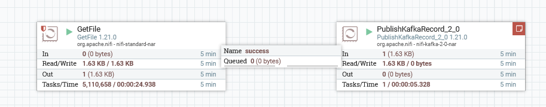

# Проект 5-го спринта


### Описание
Репозиторий предназначен для сдачи проекта 5-го спринта

### Как запустить контейнер
Сборка толстого jar файла:

```
gradlew clean kafka-cloud:bootJar
```

Запустите локально Docker:

```shell
cd infra; docker-compose up -d
```

### Развёртывание и настройка Kafka-кластера в Yandex Cloud
#### Краткое описание выполненных шагов
1. Создал Kafka-кластер в Yandex Cloud
2. Создал топик
3. Настройка продюсеров и консьюмеров для SSL передачи данных
4. Регистрация схемы в Schema Registry
5. Проверка версии схемы в Schema Registry
6. Тестирование отправки и получения сообщения

#### Конфигурация Kafka-кластера
<p float="center">
  
</p>

#### Конфигурация топика
<p float="center">
  
</p>

#### Отправка и получение сообщения
<p float="center">
  
</p>

#### Проверка регистрации Schema Registry для топика
<p float="center">
  
</p>

#### Проверка версии Schema Registry для топика
<p float="center">
  
</p>

### Интеграция Kafka с внешними системами (Apache NiFi / Hadoop)
#### Блок-схема Apache NiFi
<p float="center">
  
</p>

#### Конфигурация процессора GetFile
<p float="center">
  
</p>

#### Конфигурация процессора PublishKafkaRecord_2_0
<p float="center">
  
</p>

#### Конфигурация контроллеров
<p float="center">
  
</p>

#### Лог Apache NiFi
```text
2025-06-13 22:22:00 2025-06-13 17:22:00,849 INFO [pool-7-thread-1] o.a.n.c.r.WriteAheadFlowFileRepository Initiating checkpoint of FlowFile Repository
2025-06-13 22:22:00 2025-06-13 17:22:00,849 INFO [pool-7-thread-1] o.a.n.c.r.WriteAheadFlowFileRepository Successfully checkpointed FlowFile Repository with 1 records in 0 milliseconds
2025-06-13 22:22:06 2025-06-13 17:22:06,306 INFO [Flow Service Tasks Thread-2] o.a.nifi.controller.StandardFlowService Saved flow controller org.apache.nifi.controller.FlowController@278f7997 // Another save pending = false
2025-06-13 22:22:19 2025-06-13 17:22:19,472 INFO [Cleanup Archive for default] o.a.n.c.repository.FileSystemRepository Successfully deleted 0 files (0 bytes) from archive
2025-06-13 22:22:19 2025-06-13 17:22:19,472 INFO [Cleanup Archive for default] o.a.n.c.repository.FileSystemRepository Archive cleanup completed for container default; will now allow writing to this container. Bytes used = 104.67 GB, bytes free = 902.18 GB, capacity = 1,006.85 GB
2025-06-13 22:22:19 2025-06-13 17:22:19,511 INFO [Write-Ahead Local State Provider Maintenance] org.wali.MinimalLockingWriteAheadLog org.wali.MinimalLockingWriteAheadLog@649f48f6 checkpointed with 2 Records and 0 Swap Files in 3 milliseconds (Stop-the-world time = 0 milliseconds, Clear Edit Logs time = 0 millis), max Transaction ID 1
2025-06-13 22:22:20 2025-06-13 17:22:20,849 INFO [pool-7-thread-1] o.a.n.c.r.WriteAheadFlowFileRepository Initiating checkpoint of FlowFile Repository
2025-06-13 22:22:20 2025-06-13 17:22:20,849 INFO [pool-7-thread-1] o.a.n.c.r.WriteAheadFlowFileRepository Successfully checkpointed FlowFile Repository with 1 records in 0 milliseconds
2025-06-13 22:22:36 2025-06-13 17:22:36,429 INFO [Flow Service Tasks Thread-2] o.a.nifi.controller.StandardFlowService Saved flow controller org.apache.nifi.controller.FlowController@278f7997 // Another save pending = false
2025-06-13 22:22:40 2025-06-13 17:22:40,849 INFO [pool-7-thread-1] o.a.n.c.r.WriteAheadFlowFileRepository Initiating checkpoint of FlowFile Repository
2025-06-13 22:22:40 2025-06-13 17:22:40,849 INFO [pool-7-thread-1] o.a.n.c.r.WriteAheadFlowFileRepository Successfully checkpointed FlowFile Repository with 1 records in 0 milliseconds
2025-06-13 22:23:01 2025-06-13 17:23:00,859 INFO [pool-7-thread-1] o.a.n.c.r.WriteAheadFlowFileRepository Initiating checkpoint of FlowFile Repository
2025-06-13 22:23:01 2025-06-13 17:23:00,860 INFO [pool-7-thread-1] o.a.n.c.r.WriteAheadFlowFileRepository Successfully checkpointed FlowFile Repository with 1 records in 0 milliseconds
2025-06-13 22:23:20 2025-06-13 17:23:19,473 INFO [Cleanup Archive for default] o.a.n.c.repository.FileSystemRepository Successfully deleted 0 files (0 bytes) from archive
2025-06-13 22:23:20 2025-06-13 17:23:19,473 INFO [Cleanup Archive for default] o.a.n.c.repository.FileSystemRepository Archive cleanup completed for container default; will now allow writing to this container. Bytes used = 104.67 GB, bytes free = 902.18 GB, capacity = 1,006.85 GB
```